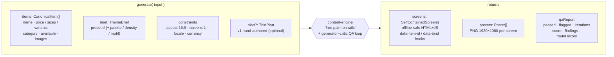
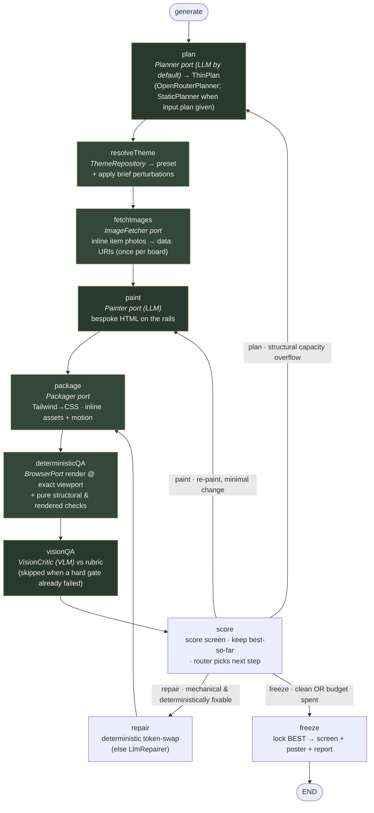
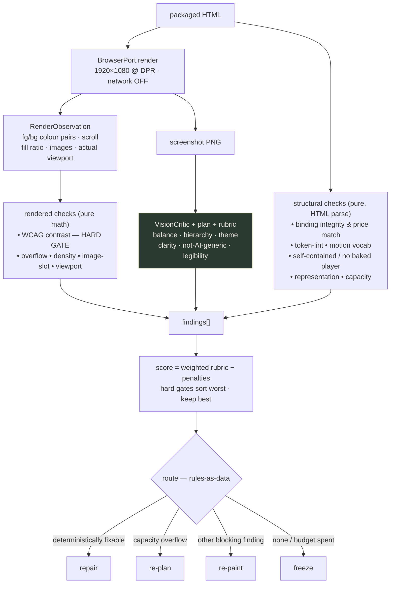
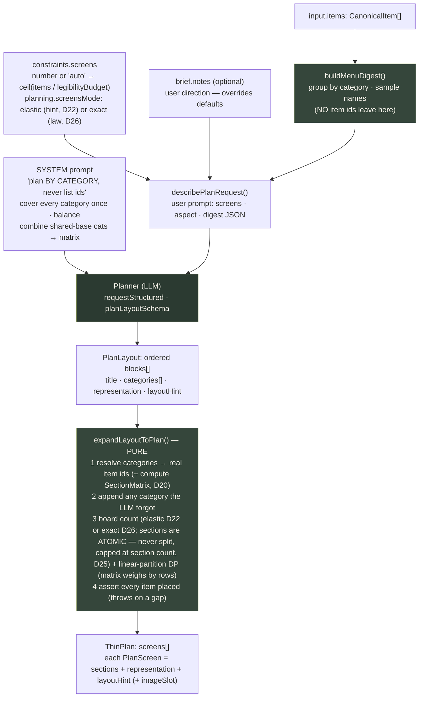
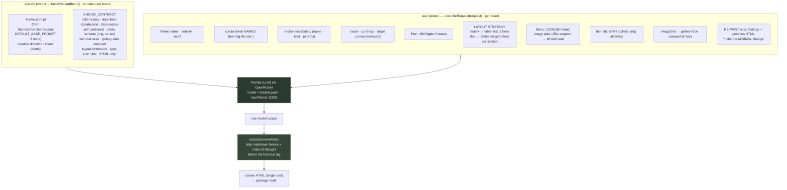
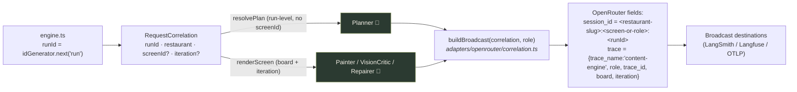

# Architecture

> **What this is.** A stateless, dependency-injected TypeScript library that turns a
> normalised menu into finished digital-signage screens via a _free-paint-on-rails_
> pipeline with a generator–critic QA loop. The spec
> (`docs/superpowers/specs/2026-06-22-display-content-generation-engine-design.md`) is the
> source of truth for behaviour; this doc is the source of truth for structure. Design
> rationale (incl. the adversarial-review fixes) lives in `DECISIONS.md`.

```
generate({ items, brief, constraints }) → { screens, posters, qaReport }
```

**Input → engine → output.** The canonical item ID threads the whole way through
(`item.id → plan → data-item-id in the HTML → runtime patch`), so a downstream service can
update price/availability later without re-generating layout.



**Brand content (D18).** `GenerateInput.brand` optionally carries a logo (+ name/tagline) rendered
as a header band on every screen. `createNodeEngine` resolves the logo `src` (URL / fs path / data:)
to a data-URI before the pure pipeline runs (`src/adapters/image/asset-resolver.ts`); the painter
emits an `` placeholder and the packager inlines it, so the artifact stays
offline-safe. The `checkBrandBinding` QA check guarantees the logo actually renders.

## 1. Design tenets (spec §10 + the build brief)

1. **Pure deterministic core, I/O behind ports.** No network, browser, clock, or
   randomness in the core. Every external concern is an injected interface; the core is
   tested with fakes and re-implemented for real in `/node`. Determinism is a property of
   the core _given fixed port outputs_ (real LLMs are best-effort — DECISIONS D15).
2. **Generator DOF ⊇ critic feedback surface** (spec §10.1). The painter writes arbitrary
   HTML so it can act on any finding; the rails constrain _tokens, motion, packaging_ —
   never layout.
3. **Rules/config as data.** Routing, token-lint, the rubric, QA thresholds, the loop
   budget, model routing, representation capacities, and required bindings are
   schema-validated data interpreted by small evaluators. Changing a rule never edits
   engine code.
4. **One composition root.** Adapters are wired in exactly one place
   (`createEngine` / `createNodeEngine`).
5. **Stable, minimal public API.** Three entry points, boundary-only exports, no
   import-time side effects.

## 2. The pipeline (spec §5.7) as a graph



> **Green nodes = LLM calls.** `plan`, `paint`, and `visionQA` always hit a model; `repair`
> is an LLM call **only** when the deterministic token-swap can't fix the finding (it falls
> back to the optional `LlmRepairer`), so it's left unmarked.
>
> Every LLM call (`plan`/`paint`/`critique`/`repair`) is stamped with a `RequestCorrelation`
> (run/board/iteration + restaurant) threaded from the engine; the OpenRouter adapter turns it
> into Broadcast `session_id` + `trace` for external observability — see §9.

The cycle (`score → repair/paint/plan → … → score`) **is** the QA correction loop.

- **Nodes** are pipeline stages: `plan, resolveTheme, fetchImages, paint, package,
deterministicQA, visionQA, score, repair, freeze`. Each is a pure
  `NodeFn = (ctx, state) => Promise<Partial<EngineState>>` over ports + config. **No node
  imports LangGraph.** `package` is its own node so "QA runs on what ships" is a graph
  invariant (D4); `paint`/`repair` are pure HTML producers.
- **State** (`EngineState`) is a Zod object; channels are last-value-wins, but the `score`
  step maintains `best` via an explicit max-by-comparator so a worse later iteration never
  destroys the best (D9/D12). `EngineState` is **distinct** from the strict LLM contract
  schemas (`PlanResponse`, `CritiqueResponse`); it embeds their inferred types (D2).
- **Conditional edges** = the §5.6 hybrid router. `route(state, config)` is **pure** and
  the **sole termination authority**: it returns `"freeze"` the instant
  `iteration >= maxIterations` (D12). `recursionLimit` is only a safety net.
- **Routing policy** (spec §5.6, as data): deterministically-fixable mechanical findings →
  `repair`; a concrete **structural-capacity** finding (planned-items > slot-capacity) →
  `plan`; other actionable findings → `paint` (minimal-change default); none, or budget
  exhausted → `freeze` (ship best-scoring, flagged).
- **Lifecycle:** `generate()` resolves the plan once (caller-supplied, else the `Planner`),
  then runs the graph **once per board** (`engine.ts` loops `plan.screens`, seeding
  `screenIndex`), each with a fresh `MemorySaver` + a fresh `thread_id` from the injected
  `IdGenerator` — boards render independently and the engine is stateless across calls (D15).
  `constraints.screens` (when a number) must equal the plan's board count. `getStateHistory`
  gives the spec §5.7 time-travel surface.

### 2.1 Inside one QA pass (what `score` / `route` act on)

QA is split on purpose: **rendered** checks are pure math over what the browser measured,
**structural** checks parse the HTML directly (the data-binding contract + the rails), and
the **vision** pass judges taste against a rubric. Everything becomes `findings`, and routing
is just data.



> Green = LLM call: only the `VisionCritic` here; the rendered and structural checks are pure.

### 2.2 How the plan is built (LLM judgment + deterministic coverage)

`plan` runs **once per `generate()`** (not per board). The LLM only makes category-level
judgment calls on a small, **id-free** digest; pure code does all the bookkeeping and
**asserts 100 % coverage** — an LLM can't be trusted to enumerate 300+ ids without dropping
some. Pass a hand-authored `plan` to bypass the LLM entirely (`StaticPlanner`).



### 2.3 How the painter prompt is built (theme owns the look, engine owns the rails)

`paint` turns one `PlanScreen` into bespoke HTML. The prompt is two strings: a **system**
prompt that is constant for a board (theme creative direction + the fixed engine contract)
and a **user** prompt carrying that board's concrete data. On a re-paint only the user prompt
grows (findings + previous HTML); the system prompt is unchanged. (`src/adapters/openrouter/painter.ts`.)



## 3. Module map

```
src/
  index.ts                  # PUBLIC main entry (pure): types, boundary schemas, errors,
                            #   ports, config defaults (frozen factories), presets, createEngine
  node.ts                   # PUBLIC node entry (Node-only): real adapters + createNodeEngine
  testing.ts                # PUBLIC testing entry: fakes + fixtures

  domain/
    schemas.ts              # Zod: CanonicalItem, ThemeBrief, GenerateInput/Output, ThinPlan,
                            #   ResolvedTheme, MotionPreset, QaFinding, QaReport, SelfContainedScreen, Poster
    contracts.ts            # STRICT LLM contracts: PlanLayout/PlanBlock (planner), CritiqueResponse (additionalProperties:false)
    types.ts                # z.infer types
    errors.ts               # ContentEngineError hierarchy (structured, typed)

  ports/
    index.ts                # barrel + EnginePorts
    planner.ts theme-repository.ts painter.ts packager.ts image-fetcher.ts
    browser.ts              # BrowserPort + RenderObservation (sampled text fg/bg, fillRatio, scroll, images, actualViewport)
    vision-critic.ts repairer.ts services.ts   # services = Clock, IdGenerator, Logger, DebugSink (D15), UsageSink (D28)
    correlation.ts          # RequestCorrelation (run/board/iteration/restaurant) threaded to the LLM ports (§9)

  config/
    index.ts                # EngineConfig assembly + loadEngineConfig (deep-merge + validate + freeze)
    routing.ts              # RoutingRules schema + defaultRoutingRules() + route evaluator data
    token-lint.ts           # TokenLintRules + defaults
    rubric.ts               # VisionRubricConfig + defaultRubric()
    qa.ts                   # QaConfig (viewport+dpr, contrast, density [+ per-representation floors],
                            #   image geometry, legibility, overflow, capacities, requiredBindings)
    planning.ts             # PlanningConfig (legibilityBudget + minItemsPerBoard + screensMode, D22/D26)
    loop.ts                 # LoopConfig (maxIterations)
    models.ts               # ModelRouting (role→model id) + structured-output allowlist

  theme/
    resolve.ts              # resolveTheme(preset, brief) → ResolvedTheme (pure; applies brief perturbations)
    presets/
      index.ts              # InMemoryThemeRepository + createDefaultThemeRepository + registry (bundled fallback)
      botanical.ts          # bundled botanical preset: tokens + motion vocab + assets — DATA
                            #   (externalized JSON themes live in themes/<id>.theme.json at the repo root
                            #    and override the bundled presets at runtime via FileThemeRepository)

  planning/                 # pure plan-time logic (coverage guarantee lives here)
    coverage.ts             # expandLayoutToPlan: layout → coverage-guaranteed ThinPlan; elastic/exact board count (D22/D26), atomic sections (D25)
    matrix.ts               # buildMatrix: cross-category base-dish comparison matrices, item-per-cell invariant (D20)
    sizing.ts               # computeTypeScale / maxRowsForCanvas: plan-time type-scale + "fits" signal (D22)
    layout-strategy.ts      # blueprint selection + strategy/matrix-summary text (shared by painter + critic, D17/D21)

  qa/
    contrast.ts             # WCAG relative luminance + ratio (pure math over rgba)
    colors.ts               # css color string → rgba (pure)
    rendered-checks.ts      # contrast/overflow/density [per-representation]/image-geometry/viewport checks (pure, D23/D24)
    structural-checks.ts    # binding integrity / token-lint / motion-vocab / matrix-structure / self-contained (pure, D21)
    representation.ts       # matrix / variant-rows / grid / list structural oracles (pure)
    scoring.ts              # findings → score + total-order comparator + pass/fail (pure)
    index.ts                # runStructuralQA / runRenderedQA composition

  repairs/
    index.ts                # pure deterministic repairs: WCAG contrast token-swap (var(--color-*)), driven by findings+theme

  util/
    freeze.ts               # deepFreeze for the frozen-factory config defaults (D16)

  pipeline/
    state.ts                # EngineState schema + NodeContext (ports + config)
    nodes/
      index.ts              # the node fns: plan, resolveTheme, fetchImages, paint, package, deterministicQA, visionQA, score, repair, freeze
      shared.ts             # currentScreen / resolveScreenItems / plannedSectionItemIds helpers
    router.ts               # route(state, config) → Route (pure; sole termination authority)
    graph.ts                # StateGraph wiring + per-call compile (the ONLY LangGraph file; plan node id is "planContent")
    engine.ts               # createEngine(ports, config) → { generate }

  adapters/                 # Node-only concrete implementations
    openrouter/             # client.ts (strict structured-output + validate + re-ask); planner/painter/vision-critic/repairer
                            #   + correlation.ts (RequestCorrelation → Broadcast session_id/trace)
    playwright/browser.ts   # render at exact viewport+dpr, network-disabled; computed-style colour pre-filter + fillRatio + screenshot
    tailwind/packager.ts    # @tailwindcss/node compile (hermetic paths) + inline assets + inline Motion-runtime marker
    image/image-fetcher.ts  # NodeImageFetcher: fetch remote photos → data: URIs (offline-safe paint/QA)
    theme/file-theme-repository.ts  # FileThemeRepository: load themes/<id>.theme.json at runtime, override bundled presets
    planner/static-planner.ts       # StaticPlanner: hand-authored-plan bypass (no LLM)
    node-engine.ts          # createNodeEngine: composition root (OpenRouterPlanner + FileThemeRepository by default)

  testing/
    fakes/                  # deterministic fakes for every port (+ scenario-scriptable painter/critic/browser)
    fixtures/               # sample menus, hand-authored plans, scripted acceptance-test scenarios
    index.ts

  playground/run.ts         # CLI: runs the engine on fixtures, writes screen + poster + QA report
```

**Dependency direction:** `domain`/`util` ← `config`/`ports`/`qa`/`repairs`/`theme` ←
`pipeline` ← `adapters`/`testing` ← `playground`. Nothing lower imports higher. Only
`pipeline/graph.ts` imports LangGraph; only `adapters/**` + `node.ts` import the optional
peers — enforced by an eslint import-boundary rule (D6).

## 4. Public API (main entry `.`) — boundary only (D16)

```ts
// Boundary schemas a consumer validates against + their types
export { generateInputSchema, generateOutputSchema } from "...";
export type {
  GenerateInput,
  GenerateOutput,
  CanonicalItem,
  ThemeBrief,
  GenerateConstraints,
  SelfContainedScreen,
  Poster,
  QaReport,
  QaScreenReport,
  QaFinding,
  ThinPlan,
  Representation,
  ResolvedTheme,
  ThemePreset,
  MotionPreset,
} from "...";

// Config-as-data: schemas (for loadEngineConfig) + frozen-factory defaults + types
export {
  loadEngineConfig,
  defaultEngineConfig,
  defaultRoutingRules,
  defaultRubric,
  defaultQaConfig,
  defaultLoopConfig,
  defaultTokenLintRules,
  defaultModelRouting,
  engineConfigSchema,
} from "...";
export type {
  EngineConfig,
  RoutingRules,
  VisionRubricConfig,
  QaConfig,
  LoopConfig,
  TokenLintRules,
  ModelRouting,
} from "...";

// Errors (structured hierarchy)
export {
  ContentEngineError,
  ValidationError,
  PaintError,
  PackagingError,
  RenderError,
  LlmContractError,
  QaBudgetError,
  UnsupportedConstraintError,
  ThemeNotFoundError,
} from "...";

// Ports (implement for custom adapters) — TYPES only
export type {
  Planner,
  ThemeRepository,
  Painter,
  Packager,
  BrowserPort,
  RenderObservation,
  VisionCritic,
  LlmRepairer,
  Clock,
  IdGenerator,
  Logger,
  DebugSink, // optional capture() per scored candidate — off by default (D15)
  DebugCapture,
  EnginePorts,
} from "...";
// NOTE: `ImageFetcher` + `RequestCorrelation` are part of `EnginePorts` but are currently
// re-exported only from the `ports/` barrel, not this main entry.

// Themes + engine
export { botanicalPreset, InMemoryThemeRepository, createEngine } from "...";
export type { ContentEngine } from "..."; // { generate(input): Promise<GenerateOutput> }
```

`./node`: `createNodeEngine`, `OpenRouterPainter`, `OpenRouterVisionCritic`,
`OpenRouterRepairer`, `PlaywrightBrowser`, `TailwindPackager`, `StaticPlanner`,
`createOpenRouterClient`. `./testing`: `createFakeEngine`, every `Fake*`, `fixtures`,
`makeScenario`.

## 5. Interfaces per swappable concern

| Port                                                   | Responsibility                                                                                                                  | Real adapter                                                      | Fake                           |
| ------------------------------------------------------ | ------------------------------------------------------------------------------------------------------------------------------- | ----------------------------------------------------------------- | ------------------------------ |
| `Planner` 🧠                                           | menu digest → category `PlanLayout`, expanded to a coverage-guaranteed `ThinPlan`                                               | `OpenRouterPlanner` (default) · `StaticPlanner` when `plan` given | scripted plan                  |
| `ThemeRepository`                                      | preset id → `ThemePreset` (tokens + motion + assets)                                                                            | `FileThemeRepository` over bundled `InMemoryThemeRepository`      | in-memory                      |
| `ImageFetcher`                                         | remote photo URLs → `data:` URIs (so paint/QA/render stay offline)                                                              | `NodeImageFetcher`                                                | deterministic map              |
| `Painter` 🧠                                           | plan-slice + theme → bespoke HTML (Tailwind + data-motion + bindings)                                                           | `OpenRouterPainter`                                               | scenario-scripted HTML         |
| `Packager`                                             | HTML + theme → self-contained artifact (Tailwind→CSS, inline assets + Motion runtime)                                           | `TailwindPackager`                                                | deterministic inline transform |
| `BrowserPort`                                          | render at exact viewport/dpr (offline) → sampled observations + screenshot                                                      | `PlaywrightBrowser`                                               | scripted observations          |
| `VisionCritic` 🧠                                      | screenshot + plan + rubric → structured findings                                                                                | `OpenRouterVisionCritic`                                          | scenario-scripted findings     |
| `LlmRepairer` 🧠                                       | LLM-backed repair (optional; deterministic repairs are pure-core, D13)                                                          | `OpenRouterRepairer`                                              | deterministic patch            |
| `Clock`/`IdGenerator`/`Logger`/`DebugSink`/`UsageSink` | time / ids (incl. thread_id) / logs / optional per-candidate capture (D15) / optional structured per-call LLM token usage (D28) | system impls                                                      | fixed clock, counter ids, noop |

🧠 = LLM-backed. Each port is narrow (1–3 methods), typed by domain Zod types.
`Planner`/`Painter`/`VisionCritic`/`LlmRepairer` are vendor-agnostic; OpenRouter is one
adapter and the role→model map is `ModelRouting` data (D1). Every LLM port also accepts a
`RequestCorrelation` for tracing (§9).

## 6. Rule / config data model

Every config block is a Zod schema with a frozen-factory default; `loadEngineConfig(partial)`
deep-merges over defaults, validates, and deep-freezes (fails loudly).

- **`RoutingRules`** — ordered `{ id, when: { source?, kindAnyOf?, tagAnyOf?, minSeverity? },
route, priority }`. The router picks the highest-priority match; falls through to
  `freeze`. The **structural-capacity** finding (`kind:"overflow-capacity"`, carrying
  `plannedCount`/`slotCount`) is what triggers `plan` — a concrete signal, not a severity
  (review S1).
- **`TokenLintRules`** — `{ allowRawHex:false, allowRawPx:false, spacingScale, … }`. Lints
  **class attrs** (arbitrary-value utilities `…-[#…]` / `…-[…px]`), **inline `style`**, and
  **`<style>` content**, on the LLM-authored markup _before_ compile (review S7/N7).
- **`VisionRubricConfig`** — `{ dimensions:[{id, description, weight, failAtSeverity}],
severityScale, passThreshold }`. Doubles as the critic's structured-output schema +
  scoring weights.
- **`QaConfig`** — `{ viewport:{width,height,dpr}, contrast:{minNormal:4.5,minLarge:3.0},
density:{minFill:0.4,maxFill:0.9, typeLedRepresentations:["matrix","list"], typeLedMinFill:0.2},
image:{distortionTolerance:0.15,maxCropFactor:2.2}, legibility, overflowTolerancePx,
blockingSeverity:"major", requiredBindings:["price"], capacities:{ matrix, "variant-rows", grid,
list }, overflowRepair:{minShrinkFactor:0.5} }` (`blockingSeverity` is the pass/fail threshold the
  scorer applies; the density under-fill floor is per-representation, D24; image-geometry thresholds
  guard distortion/over-crop, D23; `overflowRepair` bounds the deterministic shrink-to-fit repair,
  D31 — all config, not code).
- **`PlanningConfig`** — `{ legibilityBudget:24, minItemsPerBoard:4, screensMode:"elastic",
packedMultiplier:2 }` — the per-board items/rows budget (also the `screens:"auto"` target and the
  over-budget sizing threshold, D26), the sparse floor (D22), the screens mode (`"exact"` =
  requested count is law, capped only by the section count — categories are atomic and never
  split, D25/D26), and the `dense`→`packed` density-tier boundary (each plan screen is stamped
  with a deterministic `densityTier` that switches the painter idiom, the critic's judging
  register, and the packed legibility floor, D30).
- **`MenuLintConfig`** — `{ mode:"warn"|"reject"|"off", zeroPriceRender:"hide"|"verbatim",
maxNameChars, maxDescriptionChars }` — input-side data-quality lint at the `generate()`/`plan()`
  boundary; findings surface on `qaReport.menuLint`; zero/missing prices render without a price
  element instead of `$0.00` (D29).
- **`LoopConfig`** — `{ maxIterations:3 }`.
- **`ModelRouting`** — `{ plan, paint, critique, repair }` OpenRouter model ids (`adjudicate`
  retired, D32) — `structuredOutputAllowlist` checked at config load (D11). Per-role
  `resilience:{maxAttempts}` retry budgets and optional `fallback` models (tried after the primary
  exhausts its budget; validated against the allowlist like primaries) make the client the sole
  retry authority with `maxRetries:0` on the SDK, so each attempt respects `requestTimeoutMs`
  exactly (D32).

## 7. Determinism & testing strategy

- Core has zero `Date.now`/`Math.random`/`process`/`fetch` — all via ports.
- **Unit tests** per pure module cover **every rule path**: contrast at WCAG boundaries,
  each routing rule (incl. high-severity-paintable → paint, capacity → plan), each
  structural check (missing/dup binding, raw hex in class/style/`<style>`, bad motion,
  baked-in navigation, malformed HTML), density bounds, viewport precondition, scoring
  comparator + hard-gate-sorts-worst, theme resolution + brief perturbation, representation
  oracles, deterministic repairs.
- **e2e pipeline tests** run the compiled graph with fakes for the spec's three acceptance
  tests (§7): (1) dead-space rebalance via re-paint within budget; (2) WCAG contrast gate
  caught + deterministic token-swap repair; (3) `matrix` + `variant-rows` render correctly
  (structural oracle). Plus: a never-converging critic yields a **flagged best-scoring
  freeze, not a throw** (D12); the frozen output satisfies the binding contract.
- **Real adapters**: structural tests with mocked SDK/browser (prompt building, strict
  schema, response validation + re-ask) + env-gated `*.live.test.ts` (`OPENROUTER_API_KEY`,
  a browser binary) so default `verify` stays hermetic.

## 8. How to extend

- **Routing rule / QA threshold / capacity / required binding:** edit the config data (or
  pass custom config) — no code change.
- **QA check:** add a pure fn in `qa/`, register in `qa/index.ts`, emit a `QaFinding` with
  `kind` + `tag`; routing/scoring pick it up via config.
- **Theme preset / motion preset:** drop a `themes/<id>.theme.json` bundle (prompt + tokens +
  motion + assets) — `FileThemeRepository` loads it at runtime and it overrides any bundled
  preset of the same id; or add a bundled `ThemePreset` under `theme/presets/`. Tokens + the
  motion vocab flow into the rails automatically (single source of truth — D14).
- **Model swap:** edit `ModelRouting` data (ensure the id is on the structured-output
  allowlist).
- **LLM vendor:** implement `Painter`/`VisionCritic`/`LlmRepairer` against another SDK.
- **Pipeline stage:** add a `NodeFn` under `pipeline/nodes/`, wire it in `graph.ts`,
  extend `EngineState` if it carries new state.
- **Multi-screen:** already supported — author N `PlanScreen`s and `generate()` renders each
  (D5). To parallelise the per-board loop in `engine.ts`, map it onto LangGraph's `Send` API.
- **Automatic content-splitting (`screens:"auto"` or a number, no hand-authored plan):**
  implemented — `OpenRouterPlanner` gets a category-level layout from the LLM and
  `expandLayoutToPlan` (`planning/coverage.ts`) packs it into N coverage-guaranteed boards
  (§2.2). Swap the judgment by implementing `Planner`; pass `plan` to bypass the LLM entirely.
- **Image-gen backgrounds (§8):** add a per-preset cache seam on `ThemeRepository`.

## 9. Observability — request correlation & OpenRouter Broadcast

Every LLM call carries a **`RequestCorrelation`** so one `generate()` run's calls can be
grouped and filtered in an external platform. The core stays wire-format-agnostic: it only
knows the run/board/iteration/restaurant; the OpenRouter adapter turns that into the provider's
Broadcast fields. Every field is optional — callers/tests that don't trace are unaffected.



- **`session_id`** groups a board's whole QA loop into one session and is also OpenRouter's
  sticky-routing key, so it improves prompt-cache hits across a board's re-paints. It is emitted
  only when a `runId` is present.
- **`trace`** is arbitrary metadata forwarded to every configured Broadcast destination as span
  attributes (`role`, `board`, `iteration`, `restaurant`).
- Chosen over client-side LangSmith `wrapOpenAI`: correlation is provider-level data the engine
  passes through, with no extra dependency in the pure core.
