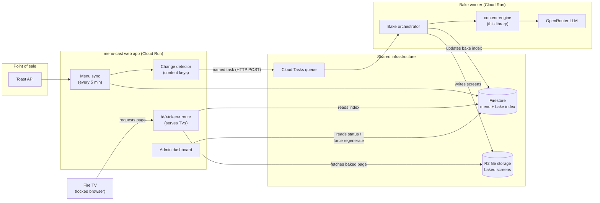
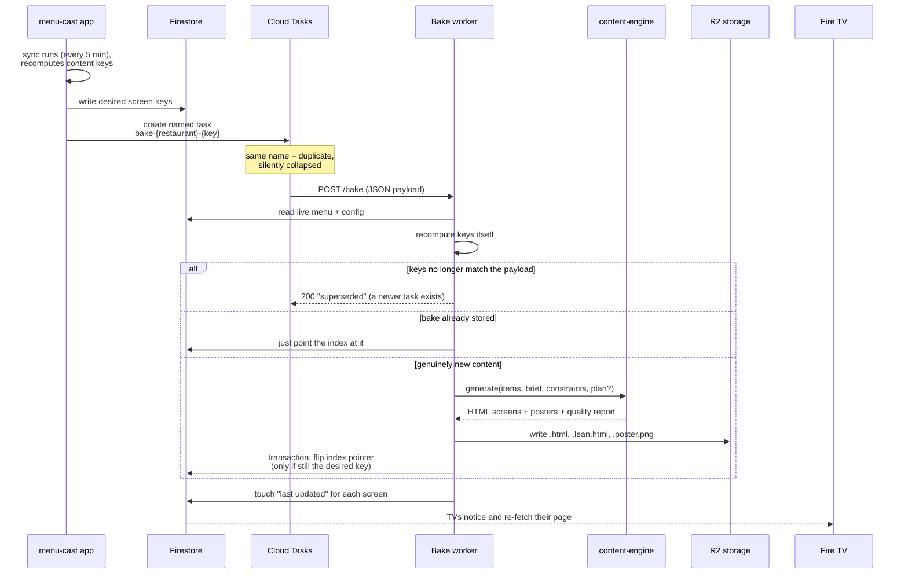

# How menu-cast and content-engine work together

This guide explains the integration between the two systems for someone new to the project. No
prior knowledge is assumed; every term is defined the first time it appears.

**The one-sentence version:** menu-cast (the restaurant app, also called ScreenFire) keeps the
menu data fresh from the point-of-sale system; content-engine (this repository) turns that menu
into finished TV screens; a small cloud worker sits between them, and a tiny patch script keeps
prices and sold-out marks truthful on the TVs without ever redrawing a screen.

---

## Glossary

| Term | Meaning |
| --- | --- |
| **menu-cast / ScreenFire** | The Next.js web app (separate repo, `kalyanram23/menu-cast`). Owns restaurant accounts, menu syncing from the Toast point-of-sale system, the admin dashboard, TV pairing, and serving pages to TVs. |
| **content-engine** | This library. Given a cleaned-up menu, it uses an LLM (large language model) plus deterministic layout code to design and render complete menu screens as self-contained HTML, with a built-in quality-check loop. |
| **Bake / a bake** | One finished screen produced by content-engine, saved as files. Called a "bake" because it is cooked once and then served many times unchanged. |
| **Bake worker** | A small dedicated cloud service (Cloud Run, code lives in menu-cast's `worker/` folder) whose only job is to run content-engine when asked and store the results. |
| **Board / screen** | One physical TV's display. A restaurant with 4 TVs has 4 boards. |
| **86'd** | Restaurant slang for "sold out / unavailable right now". |
| **Daypart** | A time window of the menu, e.g. breakfast items that only show 6:00–11:00. |
| **Composition** | The set of menu categories that are "in play" at a given moment, after daypart schedules and removals are applied. Breakfast-time and dinner-time have different compositions. |
| **Overlay** | A small block of data + JavaScript injected into a baked page when it is served, which strikes out sold-out items and patches prices/names so the TV never lies — without regenerating anything. |
| **Lean variant** | A slimmed copy of a bake where embedded photos are swapped for normal image URLs, shrinking the page from ~5–10 MB to ~100 KB so Fire TV sticks can reload it cheaply. |
| **GUID** | The unique ID the Toast point-of-sale system assigns to each menu item. It is the shared item identity across both systems. |
| **R2** | Cloudflare's file storage (works like Amazon S3). Where bakes live. |
| **Firestore** | Google's document database. Where menu-cast keeps all live state, including the "bake index" described below. |

---

## 1. The big picture

Ownership is split cleanly in two:

- **menu-cast owns data and serving** — syncing the menu from the point-of-sale system every 5
  minutes, AI clean-up of names/categories/descriptions ("curation"), deciding *when* screens need
  regenerating, storing results, and serving pages to TVs.
- **content-engine owns everything between "here is a cleaned menu" and "here are finished
  screens"** — planning which items go on which screen, visual design, rendering, and quality
  checks.



There are **three ways content-engine's code and output reach menu-cast**, and they are the whole
integration surface:

1. **A pinned library dependency** — the worker imports this repo as an npm git dependency.
2. **A file + database contract** — the worker writes bakes to R2 and a small index to Firestore
   in agreed shapes; the app reads them.
3. **An HTML markup contract** — every bake tags its items with agreed HTML attributes so the
   serve-time overlay can find and patch them years later without understanding the design.

Each is detailed below.

---

## 2. Contract 1 — the library dependency

The worker's `package.json` (in menu-cast) pins this repository at a git tag:

```json
"content-engine": "github:kalyanram23/sf-content-engine#menucast-a.2"
```

- The tag guarantees reproducible installs. The package builds itself on install (a `prepare`
  script) and ships its theme files, so the worker needs no extra setup.
- menu-cast also keeps a constant `BAKE_ENGINE_VERSION` (in `lib/bakes/env.ts`) that **must equal
  the tag name**. A test in the worker enforces this. The constant is folded into the cache keys
  (below), so bumping the engine version deliberately regenerates every restaurant's screens —
  that is a feature, not an accident.

The worker calls exactly one public API:

```ts
import { createNodeEngine } from "content-engine/node";

const engine = createNodeEngine({ openRouterApiKey, config: { painter: { mode: "auto" } } });
const out = await engine.generate({ items, brief, constraints, plan?, brand? });
```

**What goes in** (built by menu-cast's pure mapper, `lib/bakes/mapper.ts`):

| Field | Content |
| --- | --- |
| `items` | One entry per menu item: `id` = Toast GUID, `name`, `description`, `price` (or `sizes: [{label, price}]` for Small/Large-style items), `category`, `images` (photo URLs — the engine downloads and embeds them), `tags`, `available: true` always (availability is handled at serve time, never at bake time). |
| `brief` | `presetId` — the visual theme, launch default `"dhaba"`; optional accent color; the restaurant slug for log correlation. |
| `constraints` | `screens` — exactly how many TVs to fill; `aspect` — `"16:9"` (landscape) or `"9:16"` (portrait). |
| `plan` *(optional)* | A previously saved layout plan, passed back to regenerate ONE screen without moving items on the others. |
| `brand` *(optional)* | Restaurant logo + name for the header band. |

**What comes out:**

| Field | Content |
| --- | --- |
| `screens[]` | Per screen: fully self-contained HTML (fonts and photos embedded — it renders with no network), the list of item IDs on that screen, and pixel dimensions. |
| `posters[]` | A PNG snapshot of each screen (used for dashboard previews). |
| `qaReport` | Per screen: `passed` / `flagged` plus the quality findings. **Policy: the best attempt always ships, flagged or not** — findings surface in the dashboard instead of blocking. |

One engine behavior worth knowing (it shaped the worker's code): when you pass a saved `plan`, the
engine **trusts it as-is**. Extra items not mentioned by the plan are silently ignored, and a plan
that mentions a missing item ships a flagged board. The worker therefore reconciles a saved plan
against the current menu before every single-screen regeneration.

---

## 3. When do screens regenerate? The change ladder and content keys

Regenerating costs money (~$1 for a full restaurant, ~$0.10 for one screen) and time (~2–5 min),
so menu-cast sorts every menu change into the cheapest tier that can honestly handle it:

| Tier | Trigger | Cost | Mechanism |
| --- | --- | --- | --- |
| 1. Overlay | Item 86'd / back in stock, price change, rename, item removed | $0, instant | Serve-time patch script (Contract 3) |
| 2. One screen re-bakes | Item added, description or photo edited | ~$0.10, ~2 min | Re-run the engine for that screen with the saved plan |
| 3. Full re-plan | Category added/removed, big item churn, screen count / orientation / theme / engine version change | ~$1, 3–5 min | Re-run planning + all screens |
| 4. Purge | Item 86'd for over 2 days | tier 3 | Overnight job removes it properly |

The sorting is done with two **content keys** — deterministic fingerprints computed identically on
both sides (shared code in menu-cast's `lib/bakes/projection.ts`, used by app *and* worker):

- **Plan key** (per restaurant): fingerprint of the category line-up (which categories, roughly
  how many items each — counts are bucketed so one added item does not count), screen count,
  orientation, theme + design version, engine version. Changed plan key ⇒ tier 3.
- **Screen key** (per screen): plan key + fingerprint of that screen's actual display content
  (descriptions, photos, size labels and prices, badges, dietary marks). Changed screen key ⇒
  tier 2.
- **Deliberately excluded from both keys:** stock status, item names, and flat prices. Those are
  tier-1 concerns and must never trigger a regeneration.

Bakes are stored under their screen key, so identical content is found already-baked and reused
byte-for-byte, for free.

---

## 4. Contract 2 — the bake pipeline (worker protocol, storage, and index)



**The task payload** (HTTP POST body to the worker's `/bake`, defined identically on both sides
and locked by a test):

```ts
{
  restaurantId: string,
  kind: "full" | "screen",       // tier 3 or tier 2
  planKey: string,
  screenKey?: string,            // required when kind === "screen"
  screenId?: string,             //   "
  compositionId: string,         // which daypart line-up this bake is for
  requestedAt: string            // ISO timestamp
}
```

Authentication: Cloud Tasks calls the worker with Google-signed identity (enforced by Cloud Run)
plus a shared secret header `x-bake-secret` as a second layer.

**Files in R2** (all immutable — a key's content never changes once written):

```text
bakes/{restaurantId}/{screenKey}.html        # the archived original, photos embedded
bakes/{restaurantId}/{screenKey}.lean.html   # what TVs are actually served (photos as URLs)
bakes/{restaurantId}/{screenKey}.poster.png  # dashboard preview image
bakes/{restaurantId}/img/{hash}.{ext}        # the extracted photos the lean page links to
```

A cleanup job deletes objects older than 30 days that nothing references anymore.

**The bake index** (one Firestore document per restaurant, `restaurants/{id}/bakes/index`) is the
handshake between worker and app:

```ts
{
  planKey: string,               // fingerprint of the currently saved plan
  plan: {...},                   // the saved plan itself (for single-screen re-bakes)
  screens: {
    [screenId]: {
      desiredKey: string,        // what the app most recently asked for
      currentKey: string,        // what is actually baked and servable
      byComposition: {           // daypart line-up → ready bake, so daypart
        [compositionId]: key     //   switches are instant lookups
      },
      status: { passed, flagged, findings },   // quality report summary
      meta: { width, height }
    }
  }
}
```

Safety rules that make the pipeline calm under concurrency:

- **Named tasks** mean the same regeneration requested twice becomes one task.
- The worker **recomputes keys itself** and refuses to act on stale requests ("superseded").
- The index pointer flip is a **database transaction guarded by `desiredKey`** — a slow, outdated
  bake can finish and store its files, but it cannot hijack what TVs see.
- A failed screen keeps its previous `currentKey`, so TVs keep serving the last good board.

---

## 5. Contract 3 — serving to TVs and the truth overlay

A Fire TV is just a locked browser pointed at menu-cast's `/d/<signed-token>` URL. When the
integration flag (`engineBakes`) is on for a restaurant, that route stops rendering menus itself
and becomes *fetch + patch*:

```mermaid
sequenceDiagram
    participant TV as Fire TV
    participant Route as /d route (menu-cast)
    participant FS as Firestore
    participant R2 as R2 storage

    TV->>Route: GET /d/&lt;token&gt;
    Route->>FS: bake index + live menu + stock
    Route->>Route: which daypart line-up is active right now?
    Route->>R2: fetch that bake's .lean.html
    Route->>Route: build overlay data<br/>(who is 86'd, current prices/names)
    Route->>Route: append one script block before &lt;/body&gt;
    Route-->>TV: 200, complete page
    Note over TV: page heartbeats every 5s,<br/>scales itself to the panel,<br/>reloads itself at the next daypart boundary
```

The injected block contains four things:

1. **Overlay data + patch script.** A JSON snapshot of the truth right now, applied by a few
   dozen lines of vanilla JavaScript:
   - 86'd items get a strikethrough (styled with the theme's `--color-sold` CSS variable, which
     every theme is guaranteed to define);
   - current prices and names are written into the tagged elements (with a shrink-then-ellipsis
     guard if a new name is too long);
   - items the overlay does not recognize are hidden — that is how removed and delisted items
     disappear from a not-yet-regenerated board.
2. **Heartbeat.** `window.ScreenfireBridge.heartbeat()` every ~5 seconds. This is a hard contract
   with the Fire TV app: its watchdog force-restarts the app if the page stops calling it.
3. **Scale-to-panel.** The bake is a fixed 1920×1080 (or 1080×1920) stage; a tiny script scales
   it to whatever panel it lands on.
4. **Boundary self-reload.** A timer reloads the page at the next daypart switch, so breakfast →
   lunch flips sharply.

This is why "the wall never lies": prices, availability, strikes, and renames are correct on every
TV refresh regardless of how old the bake is. The only staleness window is a freshly *added* item,
which appears after its ~2-minute screen re-bake.

**The HTML markup contract** makes the patching possible. content-engine guarantees (and its
quality checks enforce) that every item on every passing bake carries:

| Marker | Purpose |
| --- | --- |
| `data-item-id="<GUID>"` on the item's row/card | Find the item. Same ID as the point-of-sale system. |
| `<span data-bind="name">` inside it | Rename target. |
| `<span data-bind="price">` inside it | Price patch target. |
| `data-size="<label>"` on each price span of a sized item (text `Half $6.50`) | Per-size price patching and per-size strikes. |
| `--color-sold` defined in the page CSS | Theme-consistent strikethrough color. |

The overlay knows nothing about themes or layout — only these attributes. That is the point: the
engine can redesign everything visual and the serving side keeps working untouched.

---

## 6. Where to go deeper

| Question | Document |
| --- | --- |
| Why was it designed this way? Full decision history | `docs/superpowers/specs/2026-06-22-…` (engine behaviour spec) and `docs/superpowers/specs/2026-07-13-menucast-integration-design.md` (integration design, incl. measured costs and the addendum with contract fine print) |
| Engine internals (pipeline, ports, QA) | `ARCHITECTURE.md`, `DECISIONS.md` (D1–D79) in this repo |
| Worker deployment, environment variables, smoke test | `worker/README.md` in the menu-cast repo |
| The pure shared modules (keys, mapper, overlay) | `lib/bakes/` in the menu-cast repo |
| Rollout state and remaining pre-production items | menu-cast branch `feat/engine-bakes`; run ledger in `.superpowers/sdd/progress.md` (this repo, local) |

**Version discipline recap** (the one thing that bites): the worker's git tag pin, the
`BAKE_ENGINE_VERSION` constant in menu-cast, and this repo's published tag must move together. A
worker test fails if the tag and constant drift; the constant feeding the plan key ensures the
regeneration that a new engine version implies actually happens.
